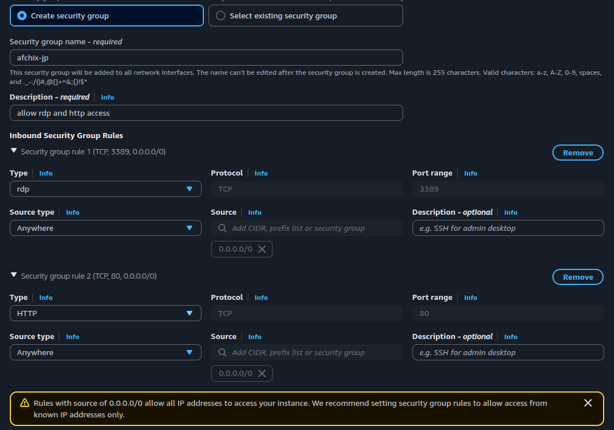

# AfChix Workshop - Hands-On Lab Instructions
## Launch a Windows Virtual Machine & Host a Website in the Cloud
**Date:** July 16, 2026
**Duration:** 50 minutes
**Trainer:** Pauline Namwakira

---

## BEFORE YOU BEGIN

> ⚠️ **SHARED ENVIRONMENT DISCLAIMER**
> We are all working in the same AWS account today. This means you will see other participants' resources (instances, key pairs, security groups) in the console. **Only interact with resources that have YOUR name on them.** Do not stop, terminate, or modify anyone else's resources.

**Naming Convention:** Use your first name in everything you create today. For example:
- Instance name: `AfChix-Grace`
- Key pair name: `key-grace`
- Security group name: `afchix-grace`

This helps everyone identify their own resources and helps the trainer clean up at the end.

---

## Step 1: Accept Your Invitation & Sign In (Do this BEFORE the workshop)

You will receive an email invitation to join AWS IAM Identity Center. This is how you get access to the AWS Console for today's lab.

### Part A: Accept the Invitation (do this before the workshop day)

1. Check your email for a message from **no-reply@login.awsapps.com** with the subject **"Invitation to join AWS IAM Identity Center"**
2. Open the email. You will see:
   - A green **"Accept invitation"** button
   - Your AWS access portal URL
   - Your Username
3. Click **"Accept invitation"**
4. You will be taken to a **"New user sign up"** page
5. Your username will be pre-filled
6. Create a password:
   - Must be at least 8 characters
   - Include uppercase, lowercase, number, and special character
   - Suggestion: `AfChix2026!`
7. Confirm your password
8. Click **"Set new password"**
9. You will see: ✅ **"Successfully created [your username]"**

You now have an account. Save your username and password, you will need them on the workshop day.

### Part B: Sign in to the AWS Console (on the workshop day)

1. Open your browser (Chrome or Firefox recommended)
2. Go to the portal URL the trainer shares on screen
3. You will see a **"Sign in"** page
4. Enter your **Username** and click **Next**
5. Enter your **Password** and click **Sign in**
6. You are now at the **AWS access portal**

### Part C: Enter the AWS Console

1. You will see a page titled **"AWS access portal"** with the **Accounts** tab selected
2. Click the **account name** (e.g., "jpauline") to expand it and reveal the role underneath
3. You will see **"AfChix-Workshop-Access"** with a link that says **"Access keys"**
4. Click **"Access keys"** -- this opens the AWS Management Console

**What is this?** This is the AWS Console, the control panel where cloud engineers manage all their cloud resources. Everything you see here represents services you can use. Today we will use just one: **EC2** (Elastic Compute Cloud, virtual machines).

---

## Step 2: Navigate to EC2

1. At the very top of the page, you will see a **search bar** (it says "Search" with a magnifying glass icon)
2. Click the search bar and type: **EC2**
3. In the dropdown results, under "Services", click **EC2**
4. You are now in the **EC2 Dashboard**

**What is EC2?** EC2 stands for Elastic Compute Cloud. It lets you rent virtual computers (called "instances") in AWS data centers around the world. Think of it as renting a laptop that lives in the cloud, except it's much more powerful and you can access it from anywhere.

**Check your Region:** Look at the top-right corner of the console. It should say **US East (N. Virginia)** or **us-east-1**. If it says something else, click the dropdown and select **US East (N. Virginia)**.

> **Why does region matter?** AWS has data centers all over the world. When you choose a region, you're choosing which physical location your virtual machine will live in. We're using N. Virginia because it has the most services available.

---

## Step 3: Launch a Windows Instance

This is where the fun begins. You are about to create a virtual computer running Windows, in the cloud.

### 3.1 Start the Launch Wizard

1. In the EC2 Dashboard, look for the section that says **"Launch instance"**
2. Click the orange **"Launch instance"** button

You are now in the Launch Instance wizard. We will fill in each section.

### 3.2 Name Your Instance

- Under **"Name and tags"**, in the **Name** field, type: `AfChix-YourName`
  - Example: `AfChix-Grace` or `AfChix-Wanjiku`
- This is how you will find YOUR instance in the list later

### 3.3 Choose the Operating System

- Under **"Application and OS Images (Amazon Machine Image)"**
- You will see tabs: Amazon Linux, macOS, Ubuntu, **Windows**, Red Hat, etc.
- Click the **"Windows"** tab
- The first option will be **"Microsoft Windows Server 2025 Base"**, it should say **"Free tier eligible"**
- Leave this selected

**What is an AMI?** AMI stands for Amazon Machine Image. It's like a template that tells AWS which operating system and software to install on your virtual machine. We picked Windows because most people are familiar with it.

### 3.4 Choose Instance Size

- Under **"Instance type"**
- You will see **t3.micro** selected by default (1 vCPU, 1 GiB memory)
- Change this to **t3.medium** (2 vCPU, 4 GiB memory)
  - Click the dropdown and search for `t3.medium`
  - Select it

**What is an instance type?** This is the "size" of your virtual computer, how much CPU and memory (RAM) it gets. Think of it like choosing between a small apartment (t3.micro) and a bigger one (t3.medium). We need t3.medium because Windows needs more memory to run smoothly.

### 3.5 Create a Key Pair

- Under **"Key pair (login)"**
- You will see a dropdown with existing key pairs, **DO NOT select any of these** (they belong to other participants or the trainer)
- Click the **"Create new key pair"** button (the link with a refresh icon to the right)
- A popup appears:
  - **Key pair name:** `key-yourname` (e.g., `key-grace`)
  - **Key pair type:** RSA (already selected)
  - **Private key file format:** .pem (already selected)
- Click **"Create key pair"**
- A file called `key-yourname.pem` will automatically download to your computer
- **KEEP THIS FILE SAFE**, you will need it to get your Windows password later

**What is a key pair?** It's like a special lock and key for your virtual machine. The .pem file you downloaded is the "key" that proves you are the owner. Without it, you cannot retrieve the password to log into your machine.

### 3.6 Network Settings (Security Group)

- Under **"Network settings"**, click **"Edit"** (top-right of this section)

> **Important:** You MUST create your own security group with a unique name. Do NOT use the default or someone else's security group. If many people try to edit the same group at the same time, it fails.

1. Select **"Create security group"** (should already be selected)
2. In **"Security group name"**, type: `afchix-yourname` (e.g., `afchix-grace`)
3. In **"Description"**, type: `allow rdp and http access`
4. Under **"Inbound Security Group Rules"**, you should already see:
   - **Security group rule 1:** Type = `rdp`, Protocol = TCP, Port range = 3389, Source = Anywhere (0.0.0.0/0)
5. Click **"Add security group rule"** to add a second rule:
   - **Security group rule 2:** Type = `HTTP`, Protocol = TCP, Port range = 80, Source type = Anywhere (0.0.0.0/0)



**What is a security group?**
Think of it as doors on your apartment:
- **RDP (port 3389)** = the door YOU use to walk in and control your machine
- **HTTP (port 80)** = the shop window that lets visitors see your website

Each person needs their own security group so we don't step on each other's settings.

### 3.7 Leave Everything Else as Default

- **Configure storage:** Leave as-is (30 GiB is fine)
- **Advanced details:** Leave collapsed, we don't need to change anything here

### 3.8 Launch!

1. Look at the **Summary** panel on the right side. Confirm:
   - Software image: Microsoft Windows Server 2025
   - Instance type: t3.medium
   - Firewall: New security group
   - Storage: 1 volume - 30 GiB
2. Click the orange **"Launch instance"** button at the bottom
3. You will see a green banner: ✅ **"Successfully initiated launch of instance"**
4. Click **"View all instances"** (or the instance ID link)

### 3.9 Wait for Your Instance to Start

- You will see your instance in the list (look for your name, e.g., "AfChix-Grace")
- **Instance state** will change from "Pending" to **"Running"** (green dot)
- **Status check** will change to **"3/3 checks passed"** ✅
- This takes **3-5 minutes**, be patient!

**Analogy:** You just rented an apartment in a building (AWS data center) in Virginia, USA. The apartment is being prepared for you. Once the status says "Running", your apartment is ready to move in!

---

## Step 3B: Explore Your Instance Details (Quick Tour)

While you wait for your instance to start (or after it's running), let's explore the information AWS gives you about your virtual machine. Click on your instance name to open the details panel below the list.

You will see several tabs. Let's look at each one:

### Details Tab

This is the "ID card" of your virtual machine. Key information:

| Field | What it means |
|-------|---------------|
| **Instance ID** | A unique identifier for your machine (like a serial number), e.g., `i-087289055bbbd2c3d` |
| **Instance state** | Whether your machine is running, stopped, or terminated |
| **Instance type** | The size you chose: `t3.medium` (2 vCPUs, 4 GiB RAM) |
| **Public IPv4 address** | Your machine's address on the internet (e.g., `32.199.165.230`). This is what you'll use to connect and view your website |
| **Private IPv4 address** | An internal address only visible within AWS's network |
| **VPC ID** | The virtual network your machine lives in |
| **Availability Zone** | The specific data center building (e.g., `us-east-1a`) |
| **AMI ID** | The template (Windows Server 2025) used to create your machine |
| **Key pair** | The key pair name you created (e.g., `afchix-key-test`) |

> **Think of it this way:** The Public IP is your apartment's street address, anyone can use it to find you. The Private IP is your apartment number within the building, only people already in the building can use it.

### Status and Alarms Tab

- Shows **System status check** ✅, **Instance status check** ✅, and **EBS status check** ✅
- These are health checks. AWS continuously monitors your machine to make sure it's running properly
- All three should show "Check passed" with green checkmarks

> This is like the building manager checking that your electricity, water, and heating are all working.

### Monitoring Tab

- Shows graphs of your machine's performance:
  - **CPU utilization**. how hard the processor is working (in %)
  - **Network in/out**. how much data is flowing in and out (in bytes)
  - **Network packets**. number of data packets sent/received
  - **CPU credit usage/balance**. t3 instances earn and spend CPU credits

> Think of monitoring as the electricity meter in your apartment. It shows how much power you're using. If CPU goes to 100%, your machine is working at full capacity.

### Security Tab

- Shows the **Security group** attached to your instance
- **Inbound rules:** Which "doors" are open:
  - Port **3389** (RDP), allows remote desktop connections
  - Port **80** (HTTP), allows web traffic for your website
- **Outbound rules:** All traffic is allowed out (your machine can access the internet)

> The security group is like the security guard at your building's entrance. It decides who can come in (inbound) and who can leave (outbound).

### Networking Tab

- Shows your **VPC** (Virtual Private Cloud), **Subnet**, and **Availability Zone**
- Shows **Public DNS**. a longer version of your address (e.g., `ec2-32-199-165-230.compute-1.amazonaws.com`)
- Shows network interfaces attached to your instance

> This is the network "wiring" of your apartment. The VPC is the whole apartment complex, the subnet is your floor, and the network interface is the ethernet port in your wall.

### Storage Tab

- Shows the **EBS volume** (Elastic Block Store) attached to your machine
- You'll see: 30 GiB, type `gp3`, status "In-use"
- This is your machine's hard drive. where Windows and all your files are stored

> This is the storage closet in your apartment. 30 GiB is the size. If you needed more, you could "add shelves" (increase the volume size).

### Tags Tab

- Shows labels attached to your instance
- You should see: **Name** = `AfChix-YourName`
- Tags are like sticky notes. they help you organize and identify your resources

---

**Now that you understand your virtual machine's details, let's connect to it!**

---

## Step 4: Connect to Your Virtual Machine

Now we will connect to your Windows machine using Remote Desktop. This lets you see and control the Windows desktop from your laptop.

### 4.1 Get Your Windows Password (everyone does this first)

1. In the EC2 Instances list, **select your instance** (click the checkbox next to it)
2. Click **"Actions"** (dropdown button at the top) > **"Security"** > **"Get Windows password"**
3. You will see a page asking for your private key
4. Click **"Upload private key file"**
5. Select the `.pem` file you downloaded earlier (e.g., `key-grace.pem`)
6. Click **"Decrypt password"**
7. You will see:
   - **Instance ID:** (your instance)
   - **Username:** Administrator
   - **Password:** (a long random string like `cd0xbySPzk06Ab0%xz-LHRYdmY7q4)Xo`)
8. **COPY THIS PASSWORD** and save it somewhere (Notepad, sticky note, wherever)

> **Note:** The password may take up to 4 minutes to become available after launch. If you see a message saying "Password is not available yet", wait a few minutes and try again.

### 4.2 Get Your Public IP Address

You need your instance's Public IP address to connect:

1. Click on your instance name in the Instances list
2. In the details panel below, look for **"Public IPv4 address"**
3. Copy this IP address (e.g., `100.48.99.218`)


---

### 4.3 Connect from Windows

If you're on a **Windows laptop**:

1. Go back to your instance, select it, click **"Connect"**
2. Click the **"RDP client"** tab
3. Click **"Download remote desktop file"**
4. Open the downloaded `.rdp` file
5. You'll see popups in this order:
   - **"Opening Remote Desktop Connection"** > Click **OK**
   - **"The identity of the remote computer cannot be verified"** > Click **"Yes"** (certificate warning, safe to accept)
   - **"Enter your credentials"** > Click "More choices" > "Use a different account" > Username: `Administrator` > Password: paste the password > Click **OK**

---

### 4.3 Connect from Mac

If you're on a **Mac**:

1. Open **Microsoft Remote Desktop** (install from App Store if you don't have it)
2. Click **"Add PC"**
3. PC name: paste your **Public IP address**
4. Click **Add**, then double-click the new connection
5. Username: `Administrator`
6. Password: paste the decrypted password
7. Accept the certificate warning

---

### 4.3 Connect from Linux (Remmina)

If you're on a **Linux laptop**, you'll use Remmina (already installed):

1. Open **Remmina** from your applications menu (or type `remmina` in terminal)


2. Make sure the protocol dropdown (top-left) shows **RDP**
3. In the address bar at the top, type your **Public IP address** (e.g., `100.48.99.218`)
4. Press **Enter** to connect
5. A **certificate warning** will appear first. Click **"Yes"** or **"Accept"** to continue
6. Then enter your credentials:
   - Username: `Administrator`
   - Password: paste the decrypted password
   - Domain: leave empty
7. Click **OK**


---

**You should now see the Windows Server desktop!**

This is a real computer running in an AWS data center in the USA. You are controlling it from your laptop here in Nairobi.

**Try these things to explore:**
- Click the **Start menu** (Windows icon, bottom-left)
- Open **File Explorer** and look at the C: drive
- Open **Microsoft Edge** (the browser) and go to google.com

**Analogy:** You just walked into your apartment. You can see the living room (desktop), open the fridge (File Explorer), and look out the window (browse the internet). But you are still physically sitting here in this room.

---

## Step 5: Deploy the AfChix Market Website

Now for the coolest part. you will install a web server and deploy a real shopping website on your virtual machine. Anyone in the world will be able to see it!

### 5.1 Open PowerShell

1. On your Windows remote desktop, right-click the **Start menu** (Windows icon, bottom-left)
2. In the Start menu, find and click **"Windows PowerShell"**
   - It's a blue window with white text. this is where we type commands

**What is PowerShell?** It's a command-line tool that lets you tell the computer what to do by typing instructions instead of clicking buttons. System administrators use this daily to manage servers.

### 5.2 Install IIS (Web Server)

Type this command exactly and press **Enter**:

```powershell
Install-WindowsFeature -name Web-Server -IncludeManagementTools
```

**What this does:** It installs **IIS (Internet Information Services)**. Microsoft's web server software. A web server is a program that listens for visitors and shows them your website. Without it, your machine wouldn't know how to serve web pages.

Wait 1-2 minutes. You'll see a progress bar and eventually:
- **Success:** True
- **Exit Code:** Success

### 5.3 Download the Website

Now we will download the AfChix Market website from GitHub (a website where developers store code).

Type this command and press **Enter**:

```powershell
Invoke-WebRequest -Uri "https://github.com/kira-PJ/afchix-cloud-workshop/archive/refs/heads/main.zip" -OutFile "C:\website.zip"
```

**What this does:** It goes to GitHub, downloads the entire website as a .zip file, and saves it to `C:\website.zip` on the server. Think of it as downloading a file from the internet. just done via command line instead of clicking a link.

### 5.4 Extract the Files

```powershell
Expand-Archive -Path "C:\website.zip" -DestinationPath "C:\website" -Force
```

**What this does:** It unzips the downloaded file into a folder called `C:\website`. Like right-clicking a .zip and choosing "Extract All". but via command.

### 5.5 Copy Files to the Web Server Folder

```powershell
Copy-Item -Path "C:\website\afchix-cloud-workshop-main\*" -Destination "C:\inetpub\wwwroot\" -Recurse -Force
```

**What this does:** It copies all the website files (HTML, images) into `C:\inetpub\wwwroot\`. this is IIS's special folder. Anything placed here automatically becomes available as a website. It's like putting products on the shelf in your shop. once they're there, customers can see them.

### 5.6 View Your Live Website!

1. Go back to your **laptop** (not the remote desktop)
2. Open a **new browser tab**
3. Go to the **EC2 Instances** page in the AWS Console
4. Find your instance and look at the **Public IPv4 address** column (e.g., `98.93.29.34`)
5. In your browser, type: `http://YOUR-PUBLIC-IP` (e.g., `http://98.93.29.34`)
6. Press Enter

**🎉 You should see the AfChix Market website. a beautiful purple and pink shopping site with Kiondo bags, Maasai bracelets, coffee, and more!**

> Notice the address bar shows just an IP address. this is your machine's address on the internet. If you shared this IP with a friend in another country, they could see this website too. This is exactly how real websites work. the only difference is they use domain names (like jumia.co.ke) instead of IP addresses.

**Take a screenshot!** Share it with friends. You just hosted a real website in the cloud! 📸

### 5.7 Personalize Your Website (Make it Yours!)

Let's make one small change. add your name to the website so everyone knows YOU built it.

In PowerShell, type this command (replace `YourName` with your actual first name):

```powershell
(Get-Content "C:\inetpub\wwwroot\index.html") -replace "Built by AfChix Workshop Participants", "Built by YourName at AfChix Workshop" | Set-Content "C:\inetpub\wwwroot\index.html"
```

**Example:** If your name is Grace:
```powershell
(Get-Content "C:\inetpub\wwwroot\index.html") -replace "Built by AfChix Workshop Participants", "Built by Grace at AfChix Workshop" | Set-Content "C:\inetpub\wwwroot\index.html"
```

**What this does:** It opens the website file, finds the text "Built by AfChix Workshop Participants" and replaces it with your name, then saves the file.

Now refresh your browser (the one showing your website). you should see your name on the pink badge in the banner!

**This is real web development.** You just edited a live website by modifying its source code on the server. Developers do this every day (though usually with fancier tools).

**Take another screenshot**. this one has YOUR name on it! 📸

---

## Step 6: Clean Up

When you're done with a cloud resource, you should always delete (terminate) it. Otherwise it keeps running and costs money. even if nobody is using it.

1. Go to the **EC2 Dashboard** > **Instances**
2. Select your instance (checkbox next to your name)
3. Click **"Instance state"** (dropdown at the top) > **"Terminate (delete) instance"**
4. A confirmation popup will appear. click **"Terminate (delete)"**

Your instance will shut down and be deleted. The virtual machine is gone. like moving out of your apartment. The IP address no longer works and your website is offline.

**Why does this matter?** In the real world, forgetting to terminate an instance is how people get unexpected AWS bills. A t3.medium costs about $0.04/hour. that's $30/month if you forget. Always clean up after yourself!

---

## CONGRATULATIONS! 🎉

Today you:
- ✅ Logged into the AWS Management Console
- ✅ Launched a Windows virtual machine in a data center in the USA
- ✅ Connected to it remotely from your laptop in Nairobi
- ✅ Installed a web server
- ✅ Deployed a real e-commerce website to the internet
- ✅ Cleaned up your cloud resources

You now understand the basics of cloud computing. This is what cloud engineers, DevOps engineers, and solutions architects do every day. just with bigger, more complex systems.

**What's next?** If you enjoyed this and want to learn more:
- Create your own free AWS account (aws.amazon.com. free tier available)
- Start with the AWS Cloud Practitioner certification
- Join the AWS User Group Kenya community

---

## TROUBLESHOOTING

| Problem | Solution |
|---------|----------|
| "Password not available yet" | Wait 4-5 minutes after launch, then try again |
| Cannot connect via RDP | Check that your instance is "Running" with "3/3 checks passed" |
| Connection timeout | Wait for status checks to pass. Also check you're using the correct Public IP |
| Wrong password | Make sure you uploaded the correct .pem file and copied the full password |
| Website not loading | Make sure you checked "Allow HTTP traffic" during launch. Check you're using `http://` (not https) |
| RDP file doesn't open (Mac) | Install Microsoft Remote Desktop from the App Store first |
| Instance won't launch | Ask the trainer. might be a region or quota issue |

---

## PARTICIPANT HANDOUT

```
================================
AfChix Cloud Computing Workshop
Your Lab Access
================================

BEFORE THE WORKSHOP:
1. Check email for "Invitation to join AWS IAM Identity Center"
2. Click "Accept invitation"
3. Create a password (suggestion: AfChix2026!)

ON THE DAY:
Portal URL: [TRAINER WILL SHARE]
Username: your email / username from the invitation
Password: the one you created

Region to use: US East (N. Virginia)

Need help? Raise your hand!
================================
```
